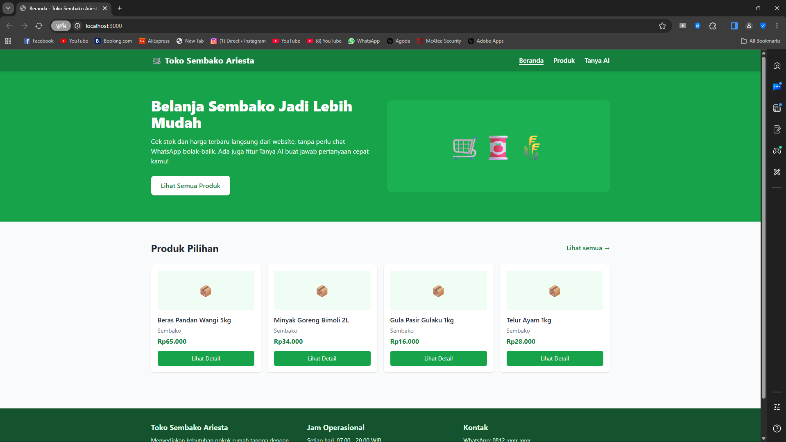
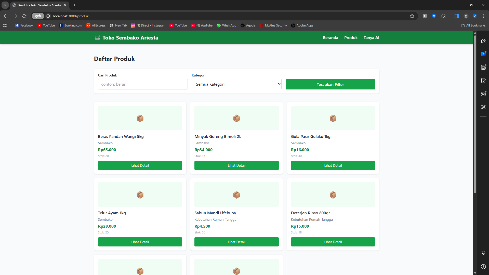
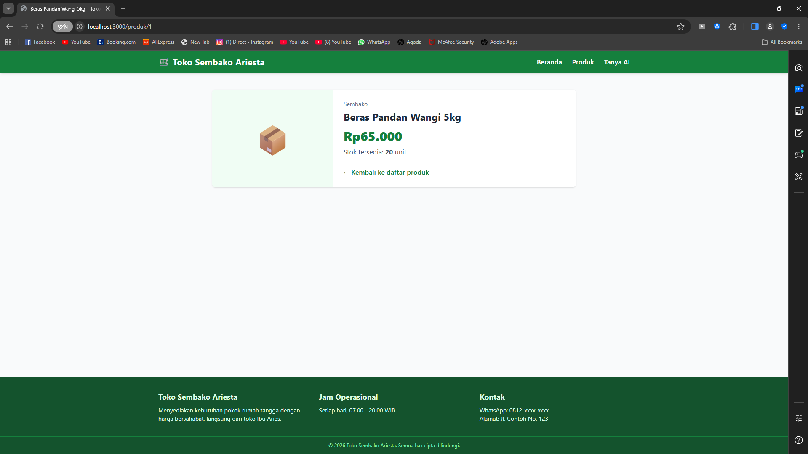
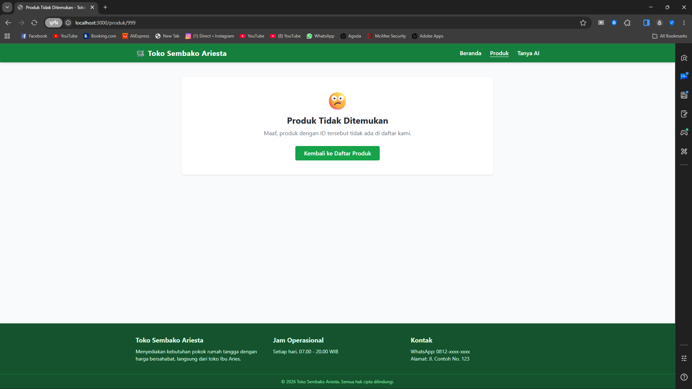
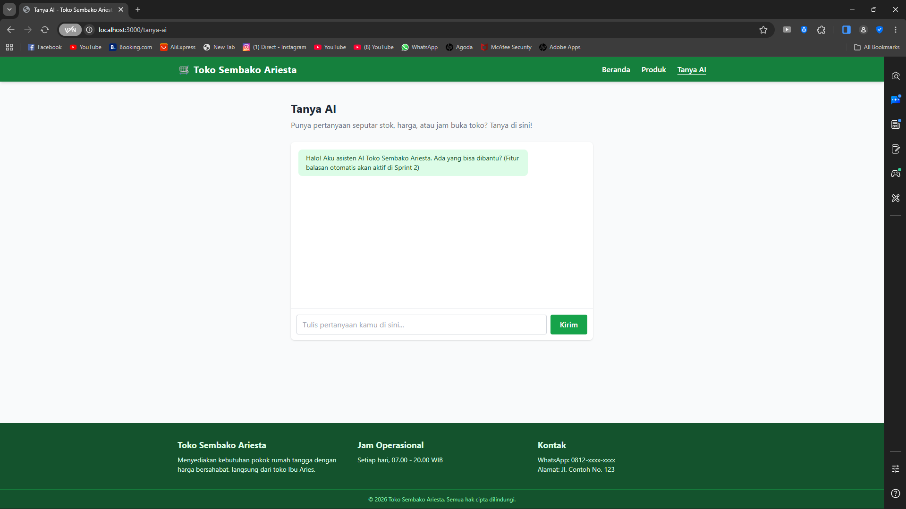

Nama: Gandhi Muhammad Bagas Saputra
NIM: 20240140045

Deskripsi Project

Website & REST API untuk Toko Sembako Ariesta, sebuah UMKM sembako & kebutuhan rumah tangga. Dibangun menggunakan Node.js + Express.js dengan view engine EJS. Project ini merupakan hasil pengerjaan **UCP 1 - Sprint 1**, berisi fondasi halaman (Beranda, Produk, Detail Produk, Tanya AI), fitur filter produk, serta endpoint REST API read-only untuk data produk.

Fitur CRUD penuh, autentikasi login admin, dan logika balasan "Tanya AI" akan ditambahkan pada Sprint 2.

## Cara Menjalankan Project Secara Lokal

1. Clone repository ini
2. Install dependencies:
   ```
   npm install
   ```
3. Jalankan server (mode development, auto-restart pakai nodemon):
   ```
   npm run dev
   ```
   Atau jalankan biasa tanpa nodemon:
   ```
   npm start
   ```
4. Buka browser ke `http://localhost:3000`

## Daftar Endpoint API

| Method | Endpoint          | Deskripsi                                   | Akses  |
|--------|-------------------|----------------------------------------------|--------|
| GET    | /api/products     | Ambil seluruh data produk sembako             | Publik |

> Endpoint CRUD lengkap (POST, PUT, DELETE), login, logout, dan chat AI dummy akan ditambahkan di Sprint 2.

## Halaman Frontend

| Route            | Deskripsi                                                                 |
|-------------------|----------------------------------------------------------------------------|
| `/`               | Beranda — hero section + preview produk pilihan                            |
| `/produk`         | Daftar semua produk, bisa difilter lewat query string `?kategori=` atau `?search=` |
| `/produk/:id`     | Detail 1 produk berdasarkan ID. Menampilkan pesan wajar jika ID tidak ditemukan |
| `/tanya-ai`       | Halaman chat + form tanya (logic balasan AI menyusul di Sprint 2)          |

## Struktur Project

```
toko-sembako-ariesta/
├── app.js                 # Entry point server Express
├── data/
│   └── products.js        # Data dummy produk
├── middleware/
│   └── logger.js          # Custom request logger middleware
├── routes/
│   ├── pages.js            # Route halaman (EJS render)
│   └── api.js               # Route REST API
├── views/
│   ├── partials/
│   │   ├── head.ejs
│   │   ├── navbar.ejs
│   │   └── footer.ejs
│   ├── index.ejs
│   ├── produk.ejs
│   ├── produk-detail.ejs
│   └── tanya-ai.ejs
└── public/
    ├── css/style.css
    └── js/main.js
```

## Teknologi

- Node.js + Express.js
- EJS (view engine) + partials
- Tailwind CSS (via CDN)
- Vanilla JavaScript (hamburger menu, form handling)

## Tampilan (UI) dan Penjelasan

Desain menggunakan tema warna hijau untuk merepresentasikan produk sembako yang segar dan terpercaya. Layout dibuat responsif dengan Tailwind CSS.

### Beranda


Halaman beranda menampilkan hero section berisi judul, deskripsi singkat toko, dan tombol ajakan "Lihat Semua Produk" agar pengunjung langsung diarahkan ke katalog. Di bawahnya ada section "Produk Pilihan" yang menampilkan 4 produk secara preview dalam bentuk card, sehingga pengunjung tidak perlu berpindah halaman dulu untuk melihat contoh produk yang dijual.

### Halaman Produk & Filter


Halaman ini menampilkan seluruh produk dalam bentuk grid card, lengkap dengan form filter di bagian atas berupa input pencarian nama produk dan dropdown kategori. Filter diproses di sisi server menggunakan query string (`?search=` dan `?kategori=`), sehingga hasil yang tampil benar-benar sesuai dengan pencarian pengguna, seperti terlihat pada contoh pencarian "beras" di atas.

### Detail Produk


Halaman detail menampilkan informasi lengkap satu produk (nama, kategori, harga, dan stok) dengan layout dua kolom: ikon/gambar produk di sisi kiri dan informasi di sisi kanan. Halaman ini diakses lewat route dinamis `/produk/:id`, di mana ID diambil langsung dari parameter URL.

### Produk Tidak Ditemukan


Ketika ID produk yang diakses tidak ada di data (contoh: `/produk/999`), sistem tidak menampilkan error atau membuat server crash, melainkan menampilkan halaman pesan "Produk Tidak Ditemukan" yang informatif, lengkap dengan tombol untuk kembali ke daftar produk. Ini menunjukkan penanganan kasus route dinamis dengan ID tidak valid sudah berjalan sesuai ketentuan.

### Tanya AI


Halaman ini menyediakan tampilan mirip chat, berisi kotak percakapan dan form input pertanyaan di bagian bawah. Form sudah dibuat aksesibel dengan label yang terhubung ke input (`for`/`id`), serta divalidasi dasar (tidak bisa submit pesan kosong) menggunakan JavaScript `preventDefault()`. Logika balasan otomatis dari AI belum diimplementasikan di sesi ini dan baru akan ditambahkan pada Sprint 2 melalui endpoint `POST /api/chat`.

### Responsive Mobile (Hamburger Menu)
(docs/6-mobile-navbar.png)
